# Excel Interactive Dashboard

Sebuah proyek analisis data ritel interaktif menggunakan **Excel** dan **SQL Database**. Dashboard ini dirancang untuk memantau performa penjualan (*Sales*), jumlah pesanan (*Orders*), serta profitabilitas (*Profit* & *Profit Margin*) lintas kategori, wilayah, segmentasi pelanggan, dan periode waktu secara dinamis.

---

## 🎥 Dashboard Preview

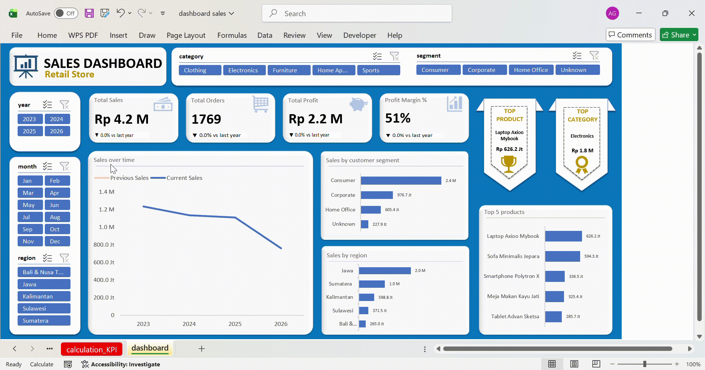

---

## Langkah-Langkah Pembuatan Dashboard

<b>Klik di sini untuk melihat langkah-langkah pembuatan scara umum (SQL, Power Query, & Formula)</b>

 

### 1. Penarikan Data dari Database (SQL)

Proses diawali dengan melakukan querying data transaksi penjualan dari database SQL (Postgresql) relasional. Proses ini menggunakan Python sebagai penghubung dengan database, kemudian melakukan query data di dalam kode python tersebut. Selengkapnya ada di file [get_data_from_database.ipynb](get_data_from_database.ipynb)

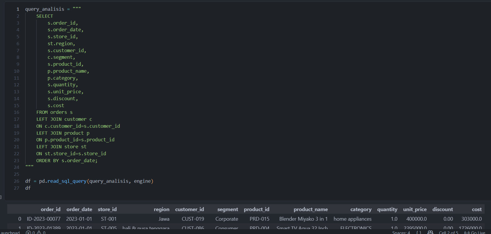

 

### 2. Persiapan data (Cleaning & Feature Engineering)

Setelah data didapatkan, proses selanjutnya adalah mempersiapkan data supaya data yang digunakan terjamin kualitasnya. Menurut prinsip "Garbage in Garbage out" maka proses ini wajib dilakukan. Persiapan data dilakukan dengan memanfaatkan Power Query pada Microsoft Excel. Proses yang dilakukan secara keseluruhan meliputi:
- Menyesuaikan tipe data
- Menghapus data duplikat
- Normalisasi dan konsistensi penulisan data kategorikal
- Mengatasi data kosong (Null Value)
- Mengatasi nilai outlier
  
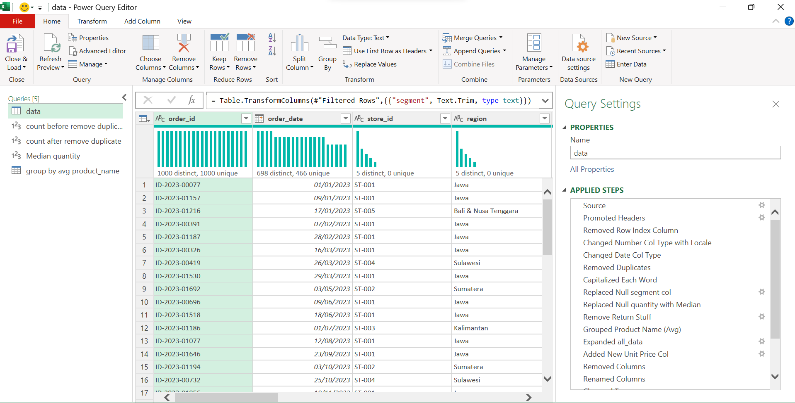

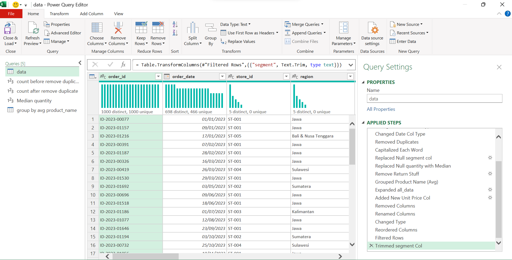

Setelah itu, dilanjutkan dengan feature engineering, seperti membuat kolom Sales, Profit, Profit Margin, Month, Month_num, Year, dan Day. Proses ini memanfaatkan fitur formula pada Microsoft Excel

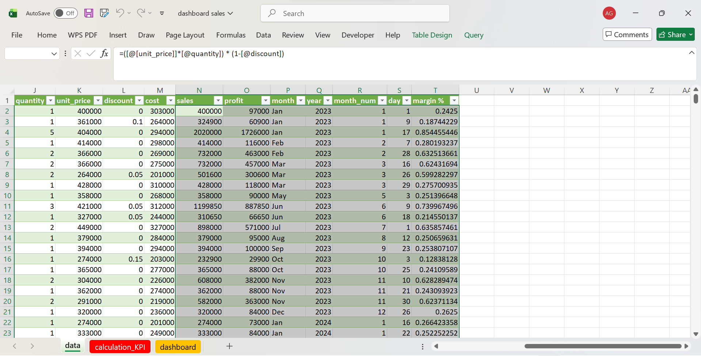

 

### 3. Perhitungan KPI & Pembuatan Grafik

Tahap berikutnya adalah melakukan penghitungan KPI & grafik dengan mengandalkan berbagai fitur pada Microsoft Excel, mulai dari Formula, Pivot Table, Name manager, Slicer, Insert Graph, dll. Proses yang disajikan hanya beberapa bagian. untuk lengkapnya silahkan buka file [dashboard_sales.xlsx](dashboard_sales.xlsx)

- Membuat Pivot tabel master untuk mempermudah proses perhitungan dan pembuatan slicer
  
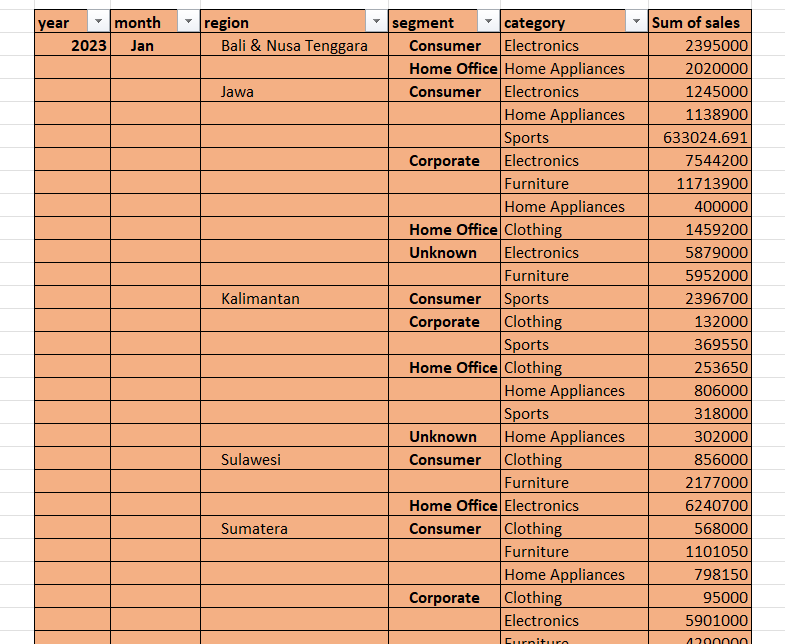

- Membuat proses perhitungan KPI.  Proses dilakukan dengan memanfaatkan fitur formula pada microsoft excel seperti IF, SUMIFS, COUNTIFS, VLOOKUP, dll.
  
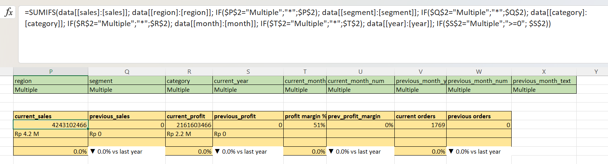

- Membuat tabel untuk line chart dinamis.  Proses ini juga memanfaatkan fitur name manager untuk membuat line chart peka terhadap perubahan tahun atau bulan dari slicer
  
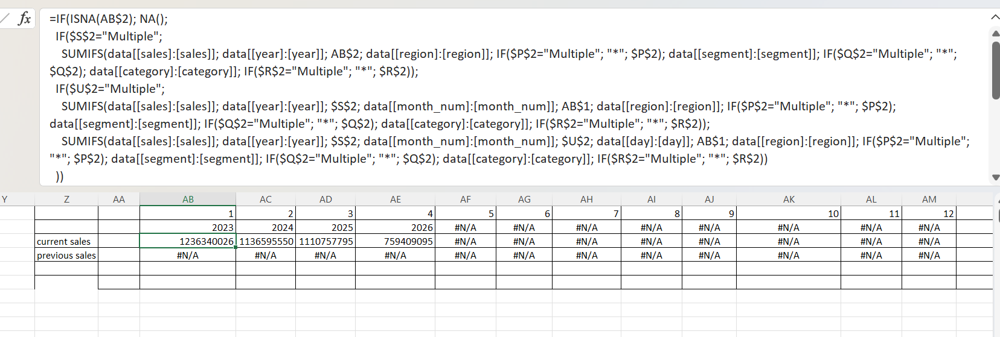

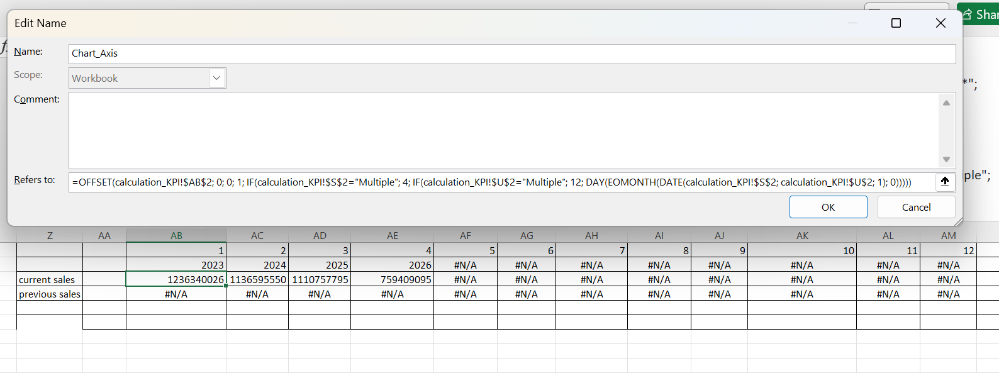

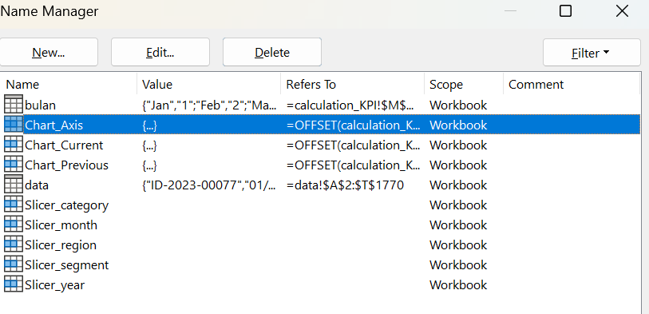

- Membuat pivot tabel untuk grafik
  
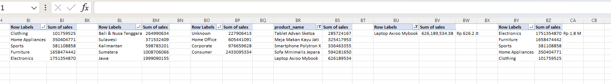

 

### 4. Mendesain Tampilan Dashboard menggunakan Microsoft Power Point

Setelah semua siap, tahapan berikutnya adalah mendesain background tampilan dashboardnya agar rapi dan nyaman dipandang. Proses ini memanfaatkan Microsoft Power Point karena mengatur desainya lebih mudah dan dapat dengan mudah di copy ke Microsoft Excel.

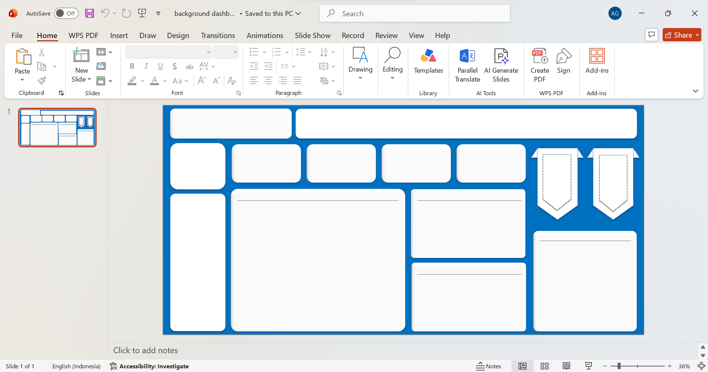

 

### 5. Put it all together

Setelah desain siap, selanjutnya tinggal copy semuanya ke sheet baru bernama dashboard di microsoft excel. Mulai dari desain, KPI, Grafik, dan Slicer yang sudah dibuat. Atur menyesuaikan desain backgroundnya.

Selesai
